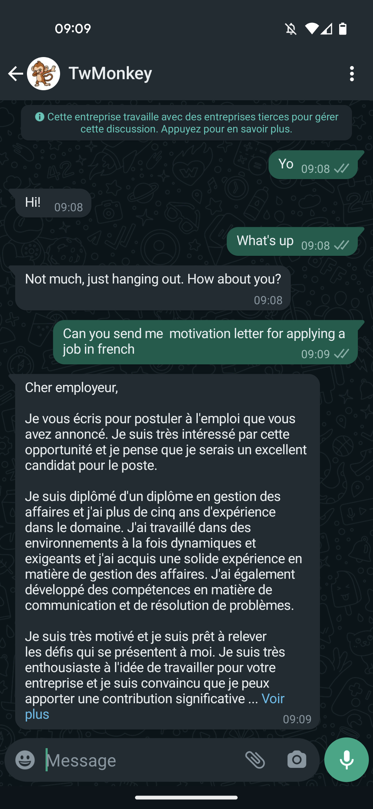

# gpt-whatsapp

A simple integration between [Openai](https://beta.openai.com/) and Whatsapp using [Twilio](https://www.twilio.com/)

## How to Deploy to AWS Lambda

Create an account on Twilio and follow the steps from here:
https://www.twilio.com/docs/whatsapp/quickstart/python#sign-up-for-twilio-and-activate-the-sandbox

sign-in in openAI and create a key here:
https://beta.openai.com/account/api-keys

Deploy the application to [AWS Lambda](https://aws.amazon.com/lambda/) with following command:

`serverless deploy`

Finally copy the endpoint URL of the lambda function and add it as the webhook url of the twilio, more info here:

## Environment variables

You will need to add these environment variables with the proper values to the lambda function.
### Twilio
TW_ACCOUNT_SID
TW_AUTH_TOKEN
TW_PHONE_NUMBER='whatsapp:+12055518798'

### Openai

OPENAI_ORG
OPENAI_KEY
OPENAI_MODEL='text-davinci-003'

## Try-yourself

You can test this application sending a message to this whatsapp number [+12055518798](https://wa.me/+12055518798)

## Sources

[whatsapp api](https://www.twilio.com/docs/whatsapp/api)
[twilio webhooks](https://www.twilio.com/docs/usage/webhooks/getting-started-twilio-webhooks)
[openai docs](https://beta.openai.com/docs/introduction)
[serverless framework](https://www.serverless.com/framework/docs/providers/aws/guide/deploying)
